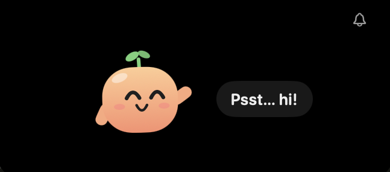
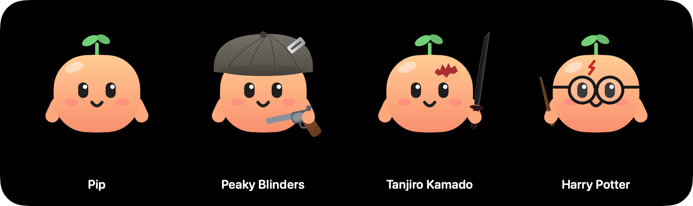

# NotchPal

Pip, a tiny peach with a sprout, lives in your MacBook's notch. It keeps you company, dances when music plays, holds files and copied items for you, and reminds you of things.

<p align="center"></p>

## The notch at a glance

Hover the notch and it opens small, with just Pip in the middle. Along the top, either side of the camera:

```
⏰ 5:00        [ camera ]        🗂 3  📋  🔔 1
```

| Where | What | Click it |
|---|---|---|
| Left | Countdown to the next reminder (only when you have one) | — |
| Right | 🗂 Shelf, with how many files it holds | Opens the File Shelf; click again to hide it |
| Right | 📋 Clipboard | Opens Clipboard History; click again to hide it |
| Right | 🔔 Bell, with how many reminders | Add a reminder, or see your reminders |

The notch only grows bigger while the Shelf, Clipboard or a reminder is open, or when you drag a file to it. The ⌃ button shrinks it back. Every time it closes, it starts small again.

While it's closed, the notch can widen a little: a tiny dancing Pip and music bars sit right beside the camera while music plays, and the shelf count shows on the right when the shelf has files.

## What Pip does

| You do | Pip does |
|---|---|
| Hover the notch | The notch grows, Pip pops up and waves hello |
| Move your mouse | Pip's eyes follow you |
| Hover Pip | Eyes widen, cheeks blush |
| Click Pip | Squishes, squints and complains ("Ow!", "Rude.") |
| Click 3 times fast | Spiral eyes and stars for a few seconds |
| Drag Pip | Dangles and flails ("Hey! Put me down!") |
| Let go while moving | Pip gets thrown, ricochets off the notch walls, then springs back home |
| Throw Pip hard (2+ hard bounces) | Gets dizzy ("Whoa… too fast…") |
| Stroke Pip slowly (no clicking) | Happy eyes and floating hearts |
| Stroke Pip right after poking | Puts up with it: half-closed eyes, flat "—" mouth. When you stop: "Okay… you're forgiven." and no longer dizzy |
| Move away | The notch shrinks back and Pip stops animating (no CPU used) |

## Characters

Pip can dress up as a few characters.

**To change character:** right-click Pip, or click the smiley icon in the menu bar, then choose **Character** and pick one. Your choice is remembered.

<p align="center"></p>

## File Shelf

Park files in the notch and drag them out later.

1. Drag a file (from Finder, the desktop, Mail, a download) toward the notch. It opens by itself when the file gets close and shows **Drop here**.
2. Let go. Pip catches it ("Got it!").
3. Later, hover the notch, click the 🗂 **Shelf icon** (right of the camera, next to the bell), and drag the item into any folder, app, email or chat.

- Up to 20 items, newest first. A 21st pushes out the oldest (Pip shrugs).
- The shelf keeps links to your files, never copies, so it uses no disk space. Moved or renamed files are followed; deleted ones fade and say "missing".
- Dragging out **copies**; hold **⌘** while dragging to move instead. The item stays on the shelf.
- Hover an item and click × to remove it, or **Clear all** at the end of the row. Right-click for Open, Show in Finder, Copy Path, Remove. Double-click opens it.
- Text or a link dragged in from a browser goes to Clipboard History instead.
- The count of shelf items shows just right of the closed notch.

## Clipboard History

Everything you copy is saved (the last 30 items).

1. Click into the text field where you want to paste.
2. Hover the notch and click the 📋 **Clipboard icon** (right of the camera, next to the bell). Hover an item to preview it.
3. Click it. It's pasted right where your cursor was, and the notch closes. Option-click pastes formatted text as plain text.

- Auto-paste needs the **Accessibility** permission (macOS asks the first time). Without it, clicking copies the item and Pip says "Copied! Press ⌘V".
- Copying the same thing again moves it to the top. Click the star to pin an item (up to 10); pinned items stay on top and are never pushed out.
- Hover an item and click × to delete it, or **Clear history** under the preview.
- Text, formatted text ("Aa"), links, images and files copied in Finder are all kept. Right-click a Finder file copy for **Add to Shelf**.
- History is kept in memory only, unless you turn on **Remember Clipboard History After Restart**. Pinned items are always saved.
- Passwords copied from password managers (1Password, Bitwarden and others that mark them as secret) are never saved.

## Dancing Pip

When music or video plays anywhere (Spotify, Apple Music, Podcasts, YouTube in Safari or Chrome), Pip dances along at a steady ~110 BPM. It doesn't listen to the actual beat.

- **Notch closed:** the black area widens a little. A tiny Pip bops just left of the camera and three bars bounce just right of it.
- **Notch open:** Pip bounces, sways and wiggles (the move changes every 8 seconds), music notes float up, and Pip's line shows "♪ Title, Artist", scrolling if it's long.
- Pause the music and Pip stops after about 2 seconds. Poking Pip makes it stumble, then it keeps dancing; getting dizzy stops the dance until Pip recovers.

How it knows: since macOS 15.4 only Apple's own apps may read what's playing, so NotchPal uses the open-source [mediaremote-adapter](https://github.com/ungive/mediaremote-adapter) (BSD 3-Clause, bundled in `Vendor/` with its license) through Apple's built-in Perl. If a macOS update breaks that, Pip just doesn't dance and the menu says **Music detection unavailable**. Nothing else is affected.

## Settings

Everything is an on/off toggle in the smiley menu bar menu:

| Setting | Default |
|---|---|
| File Shelf | On |
| Show Shelf Count Beside the Notch | On |
| Clipboard History | On |
| Auto-Paste When Clicking an Item | On (asks for Accessibility) |
| Remember Clipboard History After Restart | Off |
| Pip Nods Each Time You Copy | Off |
| Dancing Pip | On |
| Dance to Videos Too, Not Just Music | On |
| Show Song Title | On |
| Sounds | Off |
| Open at Login | Off |

The menu also has **Pause Clipboard for 1 Hour**, **Clear Shelf**, **Clear Clipboard History** and **Quit**.

Nothing leaves your Mac: no network requests, no analytics, and copied text, file names and song titles are never written to a log. Saved shelf and clipboard files live in `~/Library/Application Support/NotchPal`, readable only by you.

For the full details (what's kept and where, passwords, permissions, memory use, and how to delete everything), see [Privacy and Memory](docs/PRIVACY.md).

Want to know exactly what NotchPal keeps and how light it runs? Read [NotchPal: Privacy and Memory](https://claude.ai/artifact/MC5XgQ3icHcF7dVbNjZJr4).

## Reminders

Click the 🔔 bell (right of the camera), type a description, pick a time and press **Set**. You can also type the time in, like "tea in 5 min".

The next one counts down on the left of the notch, and Pip pops up when it's due. Click the bell again to see your reminders and delete them, or right-click it to remove one quickly.

On a Mac without a notch, a small black "fake notch" appears at the top center of the screen.

## Install

Needs macOS 14 or later and either Xcode or the Command Line Tools. If you have neither, install the tools once:

```bash
xcode-select --install
```

Then, in Terminal:

```bash
cd path/to/NotchPal
./build-app.sh --install
```

This builds **NotchPal.app**, copies it to your Applications folder and opens it. From then on, start it like any other app: Spotlight (⌘Space, type "NotchPal"), Launchpad, or double-click it in Applications.

There's no Dock icon and no window. NotchPal lives in the notch and shows a small smiley icon in the menu bar.

**Start automatically:** click the smiley in the menu bar and turn on **Open at Login**.

If you'd rather not install it, `./build-app.sh` on its own just makes `build/NotchPal.app` in the project folder, which you can double-click from there.

The script compiles a release build, draws the app icon from Pip's own drawing code, builds the music helper for Dancing Pip, writes the `Info.plist` (no Dock icon, bundle ID `com.notchpal.NotchPal`) and signs the app locally.

**Auto-paste permission:** the first time you click a clipboard item, macOS asks to allow NotchPal under System Settings → Privacy & Security → **Accessibility**. Turn it on to have items pasted for you.

## Quit

Click the smiley icon in the menu bar and choose **Quit NotchPal** (or press ⌘Q while that menu is open).

If the menu bar icon is hidden (for example behind other icons), quit from Terminal instead:

```bash
pkill -x NotchPal
```

or find "NotchPal" in Activity Monitor and click the ✕ button.

## Update after changing the code

```bash
./build-app.sh --install
```

This quits the running copy, replaces the one in Applications and opens the new one. Your reminders, shelf, pinned clipboard items, character and settings are kept.

Because the app is signed locally, macOS treats each new build as a new app, so **auto-paste stops working after every rebuild**. Turn NotchPal off and on again in System Settings → Privacy & Security → Accessibility (or remove it with − and let it ask again).

## Uninstall

1. Click the smiley in the menu bar, turn off **Open at Login**, then **Quit NotchPal**.
2. Drag `NotchPal.app` from Applications to the Trash.
3. Optional, to also delete your saved reminders, settings, shelf and pinned clipboard items:

   ```bash
   defaults delete com.notchpal.NotchPal
   rm -r ~/Library/Application\ Support/NotchPal
   ```

4. If you allowed auto-paste, remove NotchPal from System Settings → Privacy & Security → Accessibility.

## Quick run while developing

```bash
swift run
```

Or open `Package.swift` in Xcode and press ⌘R. This runs a bare program rather than the `.app`, so **Open at Login** is hidden, and reminders and settings are saved separately from the app's. Dancing Pip needs the music helper, which `./build-app.sh` builds: run it once first.

## Where to tweak

| What | File |
|---|---|
| Open notch size (small, with a panel, with a reminder) | `openSize` / `expandedSize` / `reminderSize` in `PalModel.swift` |
| Icons beside the camera (countdown, Shelf, Clipboard, bell) | `NotchEars` in `NotchView.swift` |
| How much the closed notch widens for the music peek and shelf count | `closedWings` in `PalModel.swift` |
| Shelf and Clipboard tabs, closed-notch peek | `PanelViews.swift` |
| Shelf rules (20 items, bookmarks, missing files) | `ShelfStore` in `Shelf.swift` |
| Clipboard rules (30 items, 10 pins, skipped secret types, image budget) | `ClipboardStore` in `Clipboard.swift` |
| Music detection, what counts as "music" vs "video" | `NowPlayingMonitor` in `NowPlaying.swift` |
| Dance moves, catch, shrug, nod | `Pose.make` in `PipView.swift` |
| Settings and their defaults | `Settings.swift` and `MenuContent` in `NotchPalApp.swift` |
| Reminder editor and list | `ReminderEditor` and `ReminderList` in `NotchView.swift` |
| Typed-time parsing ("in 10 min", "at 3pm") | `ReminderParser` in `Reminders.swift` |
| What Pip says | `open()`, `hit()`, `grab()`, `letGo()` and `petted()` in `PalModel.swift` |
| How long Pip holds a grudge after a poke | `upsetUntil` in `hit()` in `PalModel.swift` |
| How many clicks make Pip dizzy, and how fast | `hit()` in `PalModel.swift` |
| Colors, face, arms, sprout | `PipDrawing` in `PipView.swift` |
| Characters: outfits, names, greetings, adding a new one | `Skin` and the outfit views in `PipSkins.swift` |
| Wave, hit, dizzy motion | `Pose.make` in `PipView.swift` |
| Throw physics (bounciness, spring home, bounces to dizzy), petting speed | constants at the top of `PipMotion` in `PipMotion.swift` |
| Grow/shrink spring, notch corner shape | `NotchRootView` and `NotchShape` in `NotchView.swift` |
| How close you need to be to open it, close delay | `mouseMoved()` and `scheduleClose()` in `NotchController.swift` |
| App icon | `scripts/make-icon.swift` |
| App name, bundle ID, version | top of `build-app.sh` |
